# Chronos MCP Architecture

## System Overview

Chronos MCP is a Model Context Protocol server that provides CalDAV calendar operations through a structured, layered architecture.


## Component Architecture

### Layer Responsibilities

#### 1. MCP Interface Layer
- **MCP Server**: Handles protocol communication
- **Tool Definitions**: Exposes CalDAV operations as MCP tools
- **Input Validation**: Validates and sanitizes user input

#### 2. Business Logic Layer
- **ConfigManager**: Account configuration and persistence
- **AccountManager**: Connection lifecycle and authentication
- **CalendarManager**: Calendar CRUD operations
- **EventManager**: Event lifecycle management

#### 3. CalDAV Integration Layer
- **CalDAV Client**: WebDAV protocol implementation
- **Authentication**: Credential management
- **iCal Parser**: RFC 5545 format handling

#### 4. Data Layer
- **Pydantic Models**: Type-safe data structures
- **Config Storage**: JSON-based configuration
- **Connection Cache**: Reusable DAV connections

## Data Flow

### Request Flow


### Authentication Flow


## Module Dependencies


## Error Handling Architecture


## Security Architecture

### Current Implementation


## Class Relationships


## State Management

### Connection State


### Event Lifecycle


## Deployment Architecture

### Docker Deployment
```mermaid
graph TB
    subgraph "Container"
        APP[Chronos MCP]
        CONFIG_VOL[Config Volume]
        LOG_VOL[Log Volume]
    end
    
    subgraph "Host System"
        STDIO[STDIO]
        CONFIG_DIR[~/.config/chronos-mcp]
        LOG_DIR[/var/log/chronos-mcp]
    end
    
    subgraph "Network"
        CALDAV1[CalDAV Server 1]
        CALDAV2[CalDAV Server 2]
        CALDAVN[CalDAV Server N]
    end
    
    STDIO <--> APP
    CONFIG_DIR <--> CONFIG_VOL
    LOG_DIR <--> LOG_VOL
    
    APP --> |HTTPS| CALDAV1
    APP --> |HTTPS| CALDAV2
    APP --> |HTTPS| CALDAVN
```

### System Integration


## Performance Characteristics

### Request Processing

```mermaid
graph LR
    subgraph "Fast Operations O(1)"
        CONFIG_READ[Read Config]
        CACHE_CHECK[Check Cache]
        VALIDATE[Validate Input]
    end
    
    subgraph "Network Operations O(n)"
        AUTH[Authenticate]
        LIST_CAL[List Calendars]
        GET_EVENTS[Get Events]
    end
    
    subgraph "Heavy Operations O(n²)"
        BULK_CREATE[Bulk Create]
        CONFLICT_CHECK[Conflict Detection]
        SYNC_CAL[Calendar Sync]
    end
```


### Caching Strategy


## Scalability Considerations

### Current Limitations
- Single-threaded execution
- No connection pooling
- No request queuing
- Synchronous operations only

### Future Scalability Path


## Technology Stack

| Layer | Technology | Purpose |
|-------|------------|---------|
| Protocol | MCP (Model Context Protocol) | AI tool interface |
| Language | Python 3.9+ | Implementation language |
| Framework | None (stdlib) | Minimal dependencies |
| Models | Pydantic 2.x | Data validation |
| CalDAV | python-caldav | CalDAV protocol |
| Calendar | icalendar | iCal format parsing |
| Config | JSON | Configuration storage |
| Logging | Python logging | Error tracking |
| Testing | pytest | Test framework |
| Coverage | pytest-cov | Code coverage |

## Architectural Decisions

See [DESIGN_DECISIONS.md](./DESIGN_DECISIONS.md) for detailed rationale behind key architectural choices.
